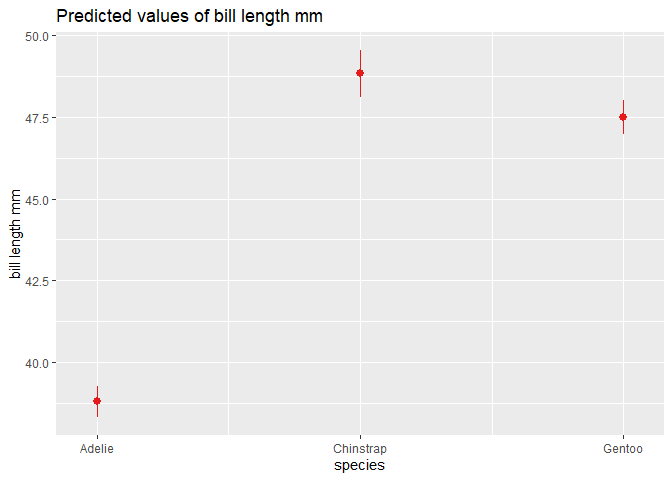
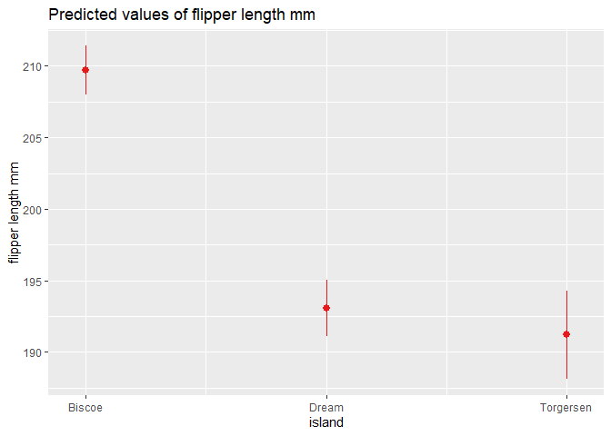
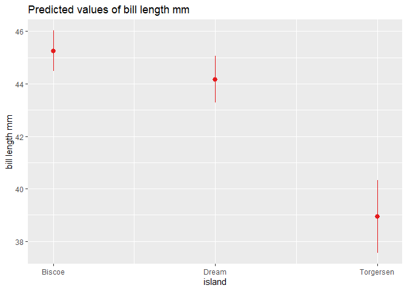
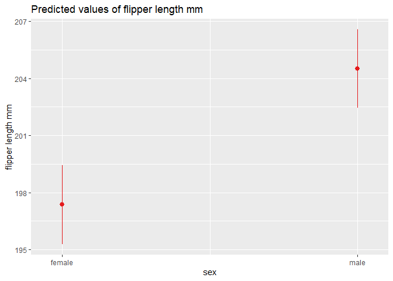
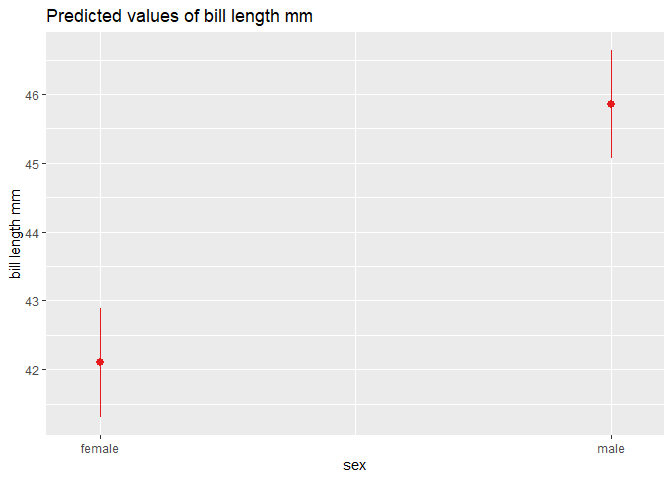
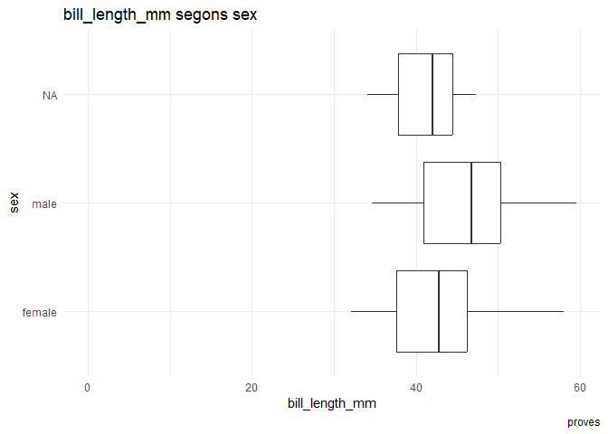
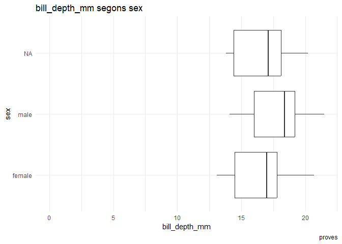
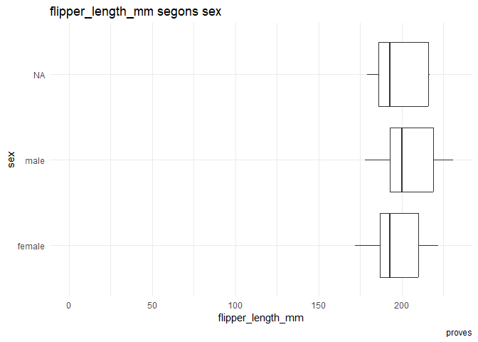
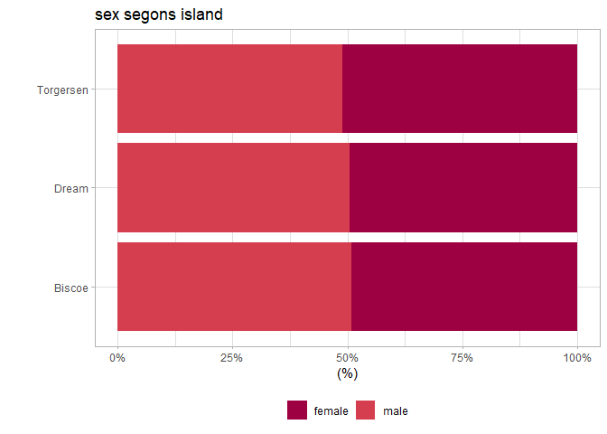
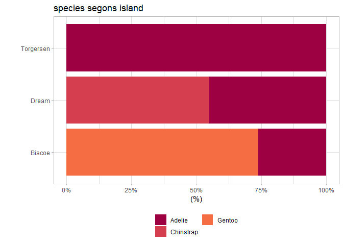

``` r
library(chunkfactory)
library(tidyverse)
```


``` r
utils::data(package = "palmerpenguins", "penguins")
penguins$pes <- 1
```


# Objectives
The package `chunkfactory`is meant to minimize the coding for markdown documents where a handful of functions need to be executed iteratively. This could facilitate, for instance, the production of documents for the exploration of bivariate descriptive statistics. 

It solves 2 problems: 

* repetitive code when performing the same operations on multiple combinations of variables
* presenting figures and tables in RMD when repeating functions on a list

The chunk factory can be applied to custom functions, or can be used with the built-in descriptive statistics functions for weighted data. Let's see the two cases. 

# Execute any function as a chunk factory {.tabset}

1. We can use the chunk factory on any custom function that generates the collection of results we need. The only restriction is that the `data` argument needs to be passed as a **text string**. Then the function needs to evaluate the text string. 

For example, we'll build a function that, for every pair of variables returns: 

* a linear regression model
* a formatted table of model results
* a tibble of model coefficients
* a predicted means plot


``` r
myfunc <- function(data_name, v1, v2){
  data <- get(data_name)
  
  myformula <- as.formula(glue::glue("{v1} ~ {v2}"))
  res1 <- lm(myformula, data = data)
  res2 <- sjPlot::tab_model(res1, use.viewer = F)
  res3 <- broom::tidy(res1)
  res4 <- sjPlot::plot_model(res1, type = "eff", terms = v2)
  
  return(list(res1, res2, res3, res4))
}
```


If we were to simply execute `myfunc()`and get the list of results it produces as is, we'd find each element is preceded by the aesthetically unpleasant `[[x]]`, and table outputs are not printed following document guidelines (i.e. paged data frames): 


``` r
myfunc("penguins", "flipper_length_mm", "species")
```

```
## [[1]]
## 
## Call:
## lm(formula = myformula, data = data)
## 
## Coefficients:
##      (Intercept)  speciesChinstrap     speciesGentoo  
##           189.95              5.87             27.23  
## 
## 
## [[2]]
## 
## [[3]]
## # A tibble: 3 × 5
##   term             estimate std.error statistic   p.value
##   <chr>               <dbl>     <dbl>     <dbl>     <dbl>
## 1 (Intercept)        190.       0.540    351.   0        
## 2 speciesChinstrap     5.87     0.970      6.05 3.79e-  9
## 3 speciesGentoo       27.2      0.807     33.8  1.84e-110
## 
## [[4]]
```

<!-- -->

chunkfactory will help us reproduce results in an optimal way for a rmd document, while minimising the iteration of code. 

2. In order to create a chunk factory, first we'll need to define a list of parameters to iterate upon. Remember that the parameters need to be named exactly as the function arguments' names, and follow the same order: 


``` r
myfunc_params <- list(
  data_name = "penguins", 
  v1        = c("flipper_length_mm", "bill_length_mm"),
  v2        = c("species", "island", "sex")
  )
```

Next we'll only need to execute our custom function with our list of parameters: 


``` r
myres <- fabrica_chunks_myfunc(
  myfunc = myfunc, 
  param_list = myfunc_params, 
  title_level = 2)
```

This generates a character vector containing the markdown, chunks and code to be evaluated. See a sample:


``` r
head(myres)
```

````
## [1] "\n\n## penguins.flipper_length_mm.species\n\n```{r echo = TRUE}\n\neval(parse(text = 'reslist[[1]][[1]]'))\neval(parse(text = 'reslist[[1]][[2]]'))\neval(parse(text = 'reslist[[1]][[3]]'))\neval(parse(text = 'reslist[[1]][[4]]'))\n```\n\n"
## [2] "\n\n## penguins.bill_length_mm.species\n\n```{r echo = TRUE}\n\neval(parse(text = 'reslist[[2]][[1]]'))\neval(parse(text = 'reslist[[2]][[2]]'))\neval(parse(text = 'reslist[[2]][[3]]'))\neval(parse(text = 'reslist[[2]][[4]]'))\n```\n\n"   
## [3] "\n\n## penguins.flipper_length_mm.island\n\n```{r echo = TRUE}\n\neval(parse(text = 'reslist[[3]][[1]]'))\neval(parse(text = 'reslist[[3]][[2]]'))\neval(parse(text = 'reslist[[3]][[3]]'))\neval(parse(text = 'reslist[[3]][[4]]'))\n```\n\n" 
## [4] "\n\n## penguins.bill_length_mm.island\n\n```{r echo = TRUE}\n\neval(parse(text = 'reslist[[4]][[1]]'))\neval(parse(text = 'reslist[[4]][[2]]'))\neval(parse(text = 'reslist[[4]][[3]]'))\neval(parse(text = 'reslist[[4]][[4]]'))\n```\n\n"    
## [5] "\n\n## penguins.flipper_length_mm.sex\n\n```{r echo = TRUE}\n\neval(parse(text = 'reslist[[5]][[1]]'))\neval(parse(text = 'reslist[[5]][[2]]'))\neval(parse(text = 'reslist[[5]][[3]]'))\neval(parse(text = 'reslist[[5]][[4]]'))\n```\n\n"    
## [6] "\n\n## penguins.bill_length_mm.sex\n\n```{r echo = TRUE}\n\neval(parse(text = 'reslist[[6]][[1]]'))\neval(parse(text = 'reslist[[6]][[2]]'))\neval(parse(text = 'reslist[[6]][[3]]'))\neval(parse(text = 'reslist[[6]][[4]]'))\n```\n\n"
````

3. The list of results is then interpreted by `knit_child()`, like in the previous example:


## penguins.flipper_length_mm.species


``` r
eval(parse(text = 'reslist[[1]][[1]]'))
```

```
## 
## Call:
## lm(formula = myformula, data = data)
## 
## Coefficients:
##      (Intercept)  speciesChinstrap     speciesGentoo  
##           189.95              5.87             27.23
```

``` r
eval(parse(text = 'reslist[[1]][[2]]'))
```

<table style="border-collapse:collapse; border:none;">
<tr>
<th style="border-top: double; text-align:center; font-style:normal; font-weight:bold; padding:0.2cm;  text-align:left; ">&nbsp;</th>
<th colspan="3" style="border-top: double; text-align:center; font-style:normal; font-weight:bold; padding:0.2cm; ">flipper length mm</th>
</tr>
<tr>
<td style=" text-align:center; border-bottom:1px solid; font-style:italic; font-weight:normal;  text-align:left; ">Predictors</td>
<td style=" text-align:center; border-bottom:1px solid; font-style:italic; font-weight:normal;  ">Estimates</td>
<td style=" text-align:center; border-bottom:1px solid; font-style:italic; font-weight:normal;  ">CI</td>
<td style=" text-align:center; border-bottom:1px solid; font-style:italic; font-weight:normal;  ">p</td>
</tr>
<tr>
<td style=" padding:0.2cm; text-align:left; vertical-align:top; text-align:left; ">(Intercept)</td>
<td style=" padding:0.2cm; text-align:left; vertical-align:top; text-align:center;  ">189.95</td>
<td style=" padding:0.2cm; text-align:left; vertical-align:top; text-align:center;  ">188.89&nbsp;&ndash;&nbsp;191.02</td>
<td style=" padding:0.2cm; text-align:left; vertical-align:top; text-align:center;  "><strong>&lt;0.001</strong></td>
</tr>
<tr>
<td style=" padding:0.2cm; text-align:left; vertical-align:top; text-align:left; ">species [Chinstrap]</td>
<td style=" padding:0.2cm; text-align:left; vertical-align:top; text-align:center;  ">5.87</td>
<td style=" padding:0.2cm; text-align:left; vertical-align:top; text-align:center;  ">3.96&nbsp;&ndash;&nbsp;7.78</td>
<td style=" padding:0.2cm; text-align:left; vertical-align:top; text-align:center;  "><strong>&lt;0.001</strong></td>
</tr>
<tr>
<td style=" padding:0.2cm; text-align:left; vertical-align:top; text-align:left; ">species [Gentoo]</td>
<td style=" padding:0.2cm; text-align:left; vertical-align:top; text-align:center;  ">27.23</td>
<td style=" padding:0.2cm; text-align:left; vertical-align:top; text-align:center;  ">25.65&nbsp;&ndash;&nbsp;28.82</td>
<td style=" padding:0.2cm; text-align:left; vertical-align:top; text-align:center;  "><strong>&lt;0.001</strong></td>
</tr>
<tr>
<td style=" padding:0.2cm; text-align:left; vertical-align:top; text-align:left; padding-top:0.1cm; padding-bottom:0.1cm; border-top:1px solid;">Observations</td>
<td style=" padding:0.2cm; text-align:left; vertical-align:top; padding-top:0.1cm; padding-bottom:0.1cm; text-align:left; border-top:1px solid;" colspan="3">342</td>
</tr>
<tr>
<td style=" padding:0.2cm; text-align:left; vertical-align:top; text-align:left; padding-top:0.1cm; padding-bottom:0.1cm;">R<sup>2</sup> / R<sup>2</sup> adjusted</td>
<td style=" padding:0.2cm; text-align:left; vertical-align:top; padding-top:0.1cm; padding-bottom:0.1cm; text-align:left;" colspan="3">0.778 / 0.777</td>
</tr>

</table>

``` r
eval(parse(text = 'reslist[[1]][[3]]'))
```

```
## # A tibble: 3 × 5
##   term             estimate std.error statistic   p.value
##   <chr>               <dbl>     <dbl>     <dbl>     <dbl>
## 1 (Intercept)        190.       0.540    351.   0        
## 2 speciesChinstrap     5.87     0.970      6.05 3.79e-  9
## 3 speciesGentoo       27.2      0.807     33.8  1.84e-110
```

``` r
eval(parse(text = 'reslist[[1]][[4]]'))
```

<!-- -->


## penguins.bill_length_mm.species


``` r
eval(parse(text = 'reslist[[2]][[1]]'))
```

```
## 
## Call:
## lm(formula = myformula, data = data)
## 
## Coefficients:
##      (Intercept)  speciesChinstrap     speciesGentoo  
##           38.791            10.042             8.713
```

``` r
eval(parse(text = 'reslist[[2]][[2]]'))
```

<table style="border-collapse:collapse; border:none;">
<tr>
<th style="border-top: double; text-align:center; font-style:normal; font-weight:bold; padding:0.2cm;  text-align:left; ">&nbsp;</th>
<th colspan="3" style="border-top: double; text-align:center; font-style:normal; font-weight:bold; padding:0.2cm; ">bill length mm</th>
</tr>
<tr>
<td style=" text-align:center; border-bottom:1px solid; font-style:italic; font-weight:normal;  text-align:left; ">Predictors</td>
<td style=" text-align:center; border-bottom:1px solid; font-style:italic; font-weight:normal;  ">Estimates</td>
<td style=" text-align:center; border-bottom:1px solid; font-style:italic; font-weight:normal;  ">CI</td>
<td style=" text-align:center; border-bottom:1px solid; font-style:italic; font-weight:normal;  ">p</td>
</tr>
<tr>
<td style=" padding:0.2cm; text-align:left; vertical-align:top; text-align:left; ">(Intercept)</td>
<td style=" padding:0.2cm; text-align:left; vertical-align:top; text-align:center;  ">38.79</td>
<td style=" padding:0.2cm; text-align:left; vertical-align:top; text-align:center;  ">38.32&nbsp;&ndash;&nbsp;39.27</td>
<td style=" padding:0.2cm; text-align:left; vertical-align:top; text-align:center;  "><strong>&lt;0.001</strong></td>
</tr>
<tr>
<td style=" padding:0.2cm; text-align:left; vertical-align:top; text-align:left; ">species [Chinstrap]</td>
<td style=" padding:0.2cm; text-align:left; vertical-align:top; text-align:center;  ">10.04</td>
<td style=" padding:0.2cm; text-align:left; vertical-align:top; text-align:center;  ">9.19&nbsp;&ndash;&nbsp;10.89</td>
<td style=" padding:0.2cm; text-align:left; vertical-align:top; text-align:center;  "><strong>&lt;0.001</strong></td>
</tr>
<tr>
<td style=" padding:0.2cm; text-align:left; vertical-align:top; text-align:left; ">species [Gentoo]</td>
<td style=" padding:0.2cm; text-align:left; vertical-align:top; text-align:center;  ">8.71</td>
<td style=" padding:0.2cm; text-align:left; vertical-align:top; text-align:center;  ">8.01&nbsp;&ndash;&nbsp;9.42</td>
<td style=" padding:0.2cm; text-align:left; vertical-align:top; text-align:center;  "><strong>&lt;0.001</strong></td>
</tr>
<tr>
<td style=" padding:0.2cm; text-align:left; vertical-align:top; text-align:left; padding-top:0.1cm; padding-bottom:0.1cm; border-top:1px solid;">Observations</td>
<td style=" padding:0.2cm; text-align:left; vertical-align:top; padding-top:0.1cm; padding-bottom:0.1cm; text-align:left; border-top:1px solid;" colspan="3">342</td>
</tr>
<tr>
<td style=" padding:0.2cm; text-align:left; vertical-align:top; text-align:left; padding-top:0.1cm; padding-bottom:0.1cm;">R<sup>2</sup> / R<sup>2</sup> adjusted</td>
<td style=" padding:0.2cm; text-align:left; vertical-align:top; padding-top:0.1cm; padding-bottom:0.1cm; text-align:left;" colspan="3">0.708 / 0.706</td>
</tr>

</table>

``` r
eval(parse(text = 'reslist[[2]][[3]]'))
```

```
## # A tibble: 3 × 5
##   term             estimate std.error statistic   p.value
##   <chr>               <dbl>     <dbl>     <dbl>     <dbl>
## 1 (Intercept)         38.8      0.241     161.  2.47e-322
## 2 speciesChinstrap    10.0      0.432      23.2 4.23e- 72
## 3 speciesGentoo        8.71     0.360      24.2 5.33e- 76
```

``` r
eval(parse(text = 'reslist[[2]][[4]]'))
```

<!-- -->


## penguins.flipper_length_mm.island


``` r
eval(parse(text = 'reslist[[3]][[1]]'))
```

```
## 
## Call:
## lm(formula = myformula, data = data)
## 
## Coefficients:
##     (Intercept)      islandDream  islandTorgersen  
##          209.71           -16.63           -18.51
```

``` r
eval(parse(text = 'reslist[[3]][[2]]'))
```

<table style="border-collapse:collapse; border:none;">
<tr>
<th style="border-top: double; text-align:center; font-style:normal; font-weight:bold; padding:0.2cm;  text-align:left; ">&nbsp;</th>
<th colspan="3" style="border-top: double; text-align:center; font-style:normal; font-weight:bold; padding:0.2cm; ">flipper length mm</th>
</tr>
<tr>
<td style=" text-align:center; border-bottom:1px solid; font-style:italic; font-weight:normal;  text-align:left; ">Predictors</td>
<td style=" text-align:center; border-bottom:1px solid; font-style:italic; font-weight:normal;  ">Estimates</td>
<td style=" text-align:center; border-bottom:1px solid; font-style:italic; font-weight:normal;  ">CI</td>
<td style=" text-align:center; border-bottom:1px solid; font-style:italic; font-weight:normal;  ">p</td>
</tr>
<tr>
<td style=" padding:0.2cm; text-align:left; vertical-align:top; text-align:left; ">(Intercept)</td>
<td style=" padding:0.2cm; text-align:left; vertical-align:top; text-align:center;  ">209.71</td>
<td style=" padding:0.2cm; text-align:left; vertical-align:top; text-align:center;  ">208.01&nbsp;&ndash;&nbsp;211.40</td>
<td style=" padding:0.2cm; text-align:left; vertical-align:top; text-align:center;  "><strong>&lt;0.001</strong></td>
</tr>
<tr>
<td style=" padding:0.2cm; text-align:left; vertical-align:top; text-align:left; ">island [Dream]</td>
<td style=" padding:0.2cm; text-align:left; vertical-align:top; text-align:center;  ">&#45;16.63</td>
<td style=" padding:0.2cm; text-align:left; vertical-align:top; text-align:center;  ">&#45;19.23&nbsp;&ndash;&nbsp;-14.04</td>
<td style=" padding:0.2cm; text-align:left; vertical-align:top; text-align:center;  "><strong>&lt;0.001</strong></td>
</tr>
<tr>
<td style=" padding:0.2cm; text-align:left; vertical-align:top; text-align:left; ">island [Torgersen]</td>
<td style=" padding:0.2cm; text-align:left; vertical-align:top; text-align:center;  ">&#45;18.51</td>
<td style=" padding:0.2cm; text-align:left; vertical-align:top; text-align:center;  ">&#45;22.02&nbsp;&ndash;&nbsp;-15.00</td>
<td style=" padding:0.2cm; text-align:left; vertical-align:top; text-align:center;  "><strong>&lt;0.001</strong></td>
</tr>
<tr>
<td style=" padding:0.2cm; text-align:left; vertical-align:top; text-align:left; padding-top:0.1cm; padding-bottom:0.1cm; border-top:1px solid;">Observations</td>
<td style=" padding:0.2cm; text-align:left; vertical-align:top; padding-top:0.1cm; padding-bottom:0.1cm; text-align:left; border-top:1px solid;" colspan="3">342</td>
</tr>
<tr>
<td style=" padding:0.2cm; text-align:left; vertical-align:top; text-align:left; padding-top:0.1cm; padding-bottom:0.1cm;">R<sup>2</sup> / R<sup>2</sup> adjusted</td>
<td style=" padding:0.2cm; text-align:left; vertical-align:top; padding-top:0.1cm; padding-bottom:0.1cm; text-align:left;" colspan="3">0.376 / 0.372</td>
</tr>

</table>

``` r
eval(parse(text = 'reslist[[3]][[3]]'))
```

```
## # A tibble: 3 × 5
##   term            estimate std.error statistic  p.value
##   <chr>              <dbl>     <dbl>     <dbl>    <dbl>
## 1 (Intercept)        210.      0.862     243.  0       
## 2 islandDream        -16.6     1.32      -12.6 4.20e-30
## 3 islandTorgersen    -18.5     1.78      -10.4 4.04e-22
```

``` r
eval(parse(text = 'reslist[[3]][[4]]'))
```

<!-- -->


## penguins.bill_length_mm.island


``` r
eval(parse(text = 'reslist[[4]][[1]]'))
```

```
## 
## Call:
## lm(formula = myformula, data = data)
## 
## Coefficients:
##     (Intercept)      islandDream  islandTorgersen  
##          45.257           -1.090           -6.307
```

``` r
eval(parse(text = 'reslist[[4]][[2]]'))
```

<table style="border-collapse:collapse; border:none;">
<tr>
<th style="border-top: double; text-align:center; font-style:normal; font-weight:bold; padding:0.2cm;  text-align:left; ">&nbsp;</th>
<th colspan="3" style="border-top: double; text-align:center; font-style:normal; font-weight:bold; padding:0.2cm; ">bill length mm</th>
</tr>
<tr>
<td style=" text-align:center; border-bottom:1px solid; font-style:italic; font-weight:normal;  text-align:left; ">Predictors</td>
<td style=" text-align:center; border-bottom:1px solid; font-style:italic; font-weight:normal;  ">Estimates</td>
<td style=" text-align:center; border-bottom:1px solid; font-style:italic; font-weight:normal;  ">CI</td>
<td style=" text-align:center; border-bottom:1px solid; font-style:italic; font-weight:normal;  ">p</td>
</tr>
<tr>
<td style=" padding:0.2cm; text-align:left; vertical-align:top; text-align:left; ">(Intercept)</td>
<td style=" padding:0.2cm; text-align:left; vertical-align:top; text-align:center;  ">45.26</td>
<td style=" padding:0.2cm; text-align:left; vertical-align:top; text-align:center;  ">44.49&nbsp;&ndash;&nbsp;46.02</td>
<td style=" padding:0.2cm; text-align:left; vertical-align:top; text-align:center;  "><strong>&lt;0.001</strong></td>
</tr>
<tr>
<td style=" padding:0.2cm; text-align:left; vertical-align:top; text-align:left; ">island [Dream]</td>
<td style=" padding:0.2cm; text-align:left; vertical-align:top; text-align:center;  ">&#45;1.09</td>
<td style=" padding:0.2cm; text-align:left; vertical-align:top; text-align:center;  ">&#45;2.26&nbsp;&ndash;&nbsp;0.08</td>
<td style=" padding:0.2cm; text-align:left; vertical-align:top; text-align:center;  ">0.069</td>
</tr>
<tr>
<td style=" padding:0.2cm; text-align:left; vertical-align:top; text-align:left; ">island [Torgersen]</td>
<td style=" padding:0.2cm; text-align:left; vertical-align:top; text-align:center;  ">&#45;6.31</td>
<td style=" padding:0.2cm; text-align:left; vertical-align:top; text-align:center;  ">&#45;7.89&nbsp;&ndash;&nbsp;-4.72</td>
<td style=" padding:0.2cm; text-align:left; vertical-align:top; text-align:center;  "><strong>&lt;0.001</strong></td>
</tr>
<tr>
<td style=" padding:0.2cm; text-align:left; vertical-align:top; text-align:left; padding-top:0.1cm; padding-bottom:0.1cm; border-top:1px solid;">Observations</td>
<td style=" padding:0.2cm; text-align:left; vertical-align:top; padding-top:0.1cm; padding-bottom:0.1cm; text-align:left; border-top:1px solid;" colspan="3">342</td>
</tr>
<tr>
<td style=" padding:0.2cm; text-align:left; vertical-align:top; text-align:left; padding-top:0.1cm; padding-bottom:0.1cm;">R<sup>2</sup> / R<sup>2</sup> adjusted</td>
<td style=" padding:0.2cm; text-align:left; vertical-align:top; padding-top:0.1cm; padding-bottom:0.1cm; text-align:left;" colspan="3">0.154 / 0.149</td>
</tr>

</table>

``` r
eval(parse(text = 'reslist[[4]][[3]]'))
```

```
## # A tibble: 3 × 5
##   term            estimate std.error statistic   p.value
##   <chr>              <dbl>     <dbl>     <dbl>     <dbl>
## 1 (Intercept)        45.3      0.390    116.   4.68e-275
## 2 islandDream        -1.09     0.597     -1.83 6.88e-  2
## 3 islandTorgersen    -6.31     0.806     -7.83 6.44e- 14
```

``` r
eval(parse(text = 'reslist[[4]][[4]]'))
```

<!-- -->


## penguins.flipper_length_mm.sex


``` r
eval(parse(text = 'reslist[[5]][[1]]'))
```

```
## 
## Call:
## lm(formula = myformula, data = data)
## 
## Coefficients:
## (Intercept)      sexmale  
##     197.364        7.142
```

``` r
eval(parse(text = 'reslist[[5]][[2]]'))
```

<table style="border-collapse:collapse; border:none;">
<tr>
<th style="border-top: double; text-align:center; font-style:normal; font-weight:bold; padding:0.2cm;  text-align:left; ">&nbsp;</th>
<th colspan="3" style="border-top: double; text-align:center; font-style:normal; font-weight:bold; padding:0.2cm; ">flipper length mm</th>
</tr>
<tr>
<td style=" text-align:center; border-bottom:1px solid; font-style:italic; font-weight:normal;  text-align:left; ">Predictors</td>
<td style=" text-align:center; border-bottom:1px solid; font-style:italic; font-weight:normal;  ">Estimates</td>
<td style=" text-align:center; border-bottom:1px solid; font-style:italic; font-weight:normal;  ">CI</td>
<td style=" text-align:center; border-bottom:1px solid; font-style:italic; font-weight:normal;  ">p</td>
</tr>
<tr>
<td style=" padding:0.2cm; text-align:left; vertical-align:top; text-align:left; ">(Intercept)</td>
<td style=" padding:0.2cm; text-align:left; vertical-align:top; text-align:center;  ">197.36</td>
<td style=" padding:0.2cm; text-align:left; vertical-align:top; text-align:center;  ">195.29&nbsp;&ndash;&nbsp;199.44</td>
<td style=" padding:0.2cm; text-align:left; vertical-align:top; text-align:center;  "><strong>&lt;0.001</strong></td>
</tr>
<tr>
<td style=" padding:0.2cm; text-align:left; vertical-align:top; text-align:left; ">sex [male]</td>
<td style=" padding:0.2cm; text-align:left; vertical-align:top; text-align:center;  ">7.14</td>
<td style=" padding:0.2cm; text-align:left; vertical-align:top; text-align:center;  ">4.22&nbsp;&ndash;&nbsp;10.07</td>
<td style=" padding:0.2cm; text-align:left; vertical-align:top; text-align:center;  "><strong>&lt;0.001</strong></td>
</tr>
<tr>
<td style=" padding:0.2cm; text-align:left; vertical-align:top; text-align:left; padding-top:0.1cm; padding-bottom:0.1cm; border-top:1px solid;">Observations</td>
<td style=" padding:0.2cm; text-align:left; vertical-align:top; padding-top:0.1cm; padding-bottom:0.1cm; text-align:left; border-top:1px solid;" colspan="3">333</td>
</tr>
<tr>
<td style=" padding:0.2cm; text-align:left; vertical-align:top; text-align:left; padding-top:0.1cm; padding-bottom:0.1cm;">R<sup>2</sup> / R<sup>2</sup> adjusted</td>
<td style=" padding:0.2cm; text-align:left; vertical-align:top; padding-top:0.1cm; padding-bottom:0.1cm; text-align:left;" colspan="3">0.065 / 0.062</td>
</tr>

</table>

``` r
eval(parse(text = 'reslist[[5]][[3]]'))
```

```
## # A tibble: 2 × 5
##   term        estimate std.error statistic    p.value
##   <chr>          <dbl>     <dbl>     <dbl>      <dbl>
## 1 (Intercept)   197.        1.06    187.   0         
## 2 sexmale         7.14      1.49      4.80 0.00000239
```

``` r
eval(parse(text = 'reslist[[5]][[4]]'))
```

<!-- -->


## penguins.bill_length_mm.sex


``` r
eval(parse(text = 'reslist[[6]][[1]]'))
```

```
## 
## Call:
## lm(formula = myformula, data = data)
## 
## Coefficients:
## (Intercept)      sexmale  
##      42.097        3.758
```

``` r
eval(parse(text = 'reslist[[6]][[2]]'))
```

<table style="border-collapse:collapse; border:none;">
<tr>
<th style="border-top: double; text-align:center; font-style:normal; font-weight:bold; padding:0.2cm;  text-align:left; ">&nbsp;</th>
<th colspan="3" style="border-top: double; text-align:center; font-style:normal; font-weight:bold; padding:0.2cm; ">bill length mm</th>
</tr>
<tr>
<td style=" text-align:center; border-bottom:1px solid; font-style:italic; font-weight:normal;  text-align:left; ">Predictors</td>
<td style=" text-align:center; border-bottom:1px solid; font-style:italic; font-weight:normal;  ">Estimates</td>
<td style=" text-align:center; border-bottom:1px solid; font-style:italic; font-weight:normal;  ">CI</td>
<td style=" text-align:center; border-bottom:1px solid; font-style:italic; font-weight:normal;  ">p</td>
</tr>
<tr>
<td style=" padding:0.2cm; text-align:left; vertical-align:top; text-align:left; ">(Intercept)</td>
<td style=" padding:0.2cm; text-align:left; vertical-align:top; text-align:center;  ">42.10</td>
<td style=" padding:0.2cm; text-align:left; vertical-align:top; text-align:center;  ">41.31&nbsp;&ndash;&nbsp;42.88</td>
<td style=" padding:0.2cm; text-align:left; vertical-align:top; text-align:center;  "><strong>&lt;0.001</strong></td>
</tr>
<tr>
<td style=" padding:0.2cm; text-align:left; vertical-align:top; text-align:left; ">sex [male]</td>
<td style=" padding:0.2cm; text-align:left; vertical-align:top; text-align:center;  ">3.76</td>
<td style=" padding:0.2cm; text-align:left; vertical-align:top; text-align:center;  ">2.65&nbsp;&ndash;&nbsp;4.87</td>
<td style=" padding:0.2cm; text-align:left; vertical-align:top; text-align:center;  "><strong>&lt;0.001</strong></td>
</tr>
<tr>
<td style=" padding:0.2cm; text-align:left; vertical-align:top; text-align:left; padding-top:0.1cm; padding-bottom:0.1cm; border-top:1px solid;">Observations</td>
<td style=" padding:0.2cm; text-align:left; vertical-align:top; padding-top:0.1cm; padding-bottom:0.1cm; text-align:left; border-top:1px solid;" colspan="3">333</td>
</tr>
<tr>
<td style=" padding:0.2cm; text-align:left; vertical-align:top; text-align:left; padding-top:0.1cm; padding-bottom:0.1cm;">R<sup>2</sup> / R<sup>2</sup> adjusted</td>
<td style=" padding:0.2cm; text-align:left; vertical-align:top; padding-top:0.1cm; padding-bottom:0.1cm; text-align:left;" colspan="3">0.118 / 0.116</td>
</tr>

</table>

``` r
eval(parse(text = 'reslist[[6]][[3]]'))
```

```
## # A tibble: 2 × 5
##   term        estimate std.error statistic   p.value
##   <chr>          <dbl>     <dbl>     <dbl>     <dbl>
## 1 (Intercept)    42.1      0.400    105.   2.18e-256
## 2 sexmale         3.76     0.564      6.67 1.09e- 10
```

``` r
eval(parse(text = 'reslist[[6]][[4]]'))
```

<!-- -->


# Examples with built-in functions

The package includes built-in functions in order to perform bivariate analyses with weighted data. 

If the dependent variable is numeric, results will show: 

* grouped descriptive statistics
* grouped boxplots

If the dependent variable is categorical, results will show:

* a cross-tab in tidy format, including adjusted-standardized residuals [citation]
* stacked bar chart

Results are organized into tabsets, like in the following example: 

## Bivariates by sex {.tabset}

``` r
myres <- fabrica_chunks(
  vd = c("bill_length_mm", "bill_depth_mm", "flipper_length_mm"), 
  vi = c("sex"), 
  d = "penguins", 
  w = "pes")
```

`myres` generates a vector character containing the code that will be later evaluated with `knit_child` 


### bill_length_mm x sex


``` r
eval(parse(text = (reslist_mytab[[1]][[1]])))
```

```
## # A tibble: 3 × 9
##   sex        n     N mitjana mediana desv_tip margin lower upper
##   <fct>  <int> <dbl>   <dbl>   <dbl>    <dbl>  <dbl> <dbl> <dbl>
## 1 female   165   165    42.1    42.8     4.90  0.754  41.3  42.9
## 2 male     168   168    45.9    46.8     5.37  0.817  45.0  46.7
## 3 <NA>      11    11    41.3    42       4.63  3.07   38.2  44.4
```

``` r
eval(parse(text = (reslist_mytab[[1]][[2]])))
```

<!-- -->


### bill_depth_mm x sex


``` r
eval(parse(text = (reslist_mytab[[2]][[1]])))
```

```
## # A tibble: 3 × 9
##   sex        n     N mitjana mediana desv_tip margin lower upper
##   <fct>  <int> <dbl>   <dbl>   <dbl>    <dbl>  <dbl> <dbl> <dbl>
## 1 female   165   165    16.4    17       1.80  0.276  16.1  16.7
## 2 male     168   168    17.9    18.4     1.86  0.284  17.6  18.2
## 3 <NA>      11    11    16.6    17.1     2.24  1.48   15.2  18.1
```

``` r
eval(parse(text = (reslist_mytab[[2]][[2]])))
```

<!-- -->


### flipper_length_mm x sex


``` r
eval(parse(text = (reslist_mytab[[3]][[1]])))
```

```
## # A tibble: 3 × 9
##   sex        n     N mitjana mediana desv_tip margin lower upper
##   <fct>  <int> <dbl>   <dbl>   <dbl>    <dbl>  <dbl> <dbl> <dbl>
## 1 female   165   165    197.    193      12.5   1.92  195.  199.
## 2 male     168   168    205.    200.     14.5   2.22  202.  207.
## 3 <NA>      11    11    199     193      16.5  10.9   188.  210.
```

``` r
eval(parse(text = (reslist_mytab[[3]][[2]])))
```

<!-- -->


## Bivariates by island {.tabset}

``` r
myres <- fabrica_chunks(
  vd = c("sex", "species"), 
  vi = c("island"), 
  d = "penguins", 
  w = "pes")
```


### sex x island


``` r
eval(parse(text = (reslist_mytab[[1]][[1]])))
```

```
## # A tibble: 6 × 7
##   VI        VD         N     n    TT    PP  ASres
##   <chr>     <chr>  <dbl> <int> <dbl> <dbl>  <dbl>
## 1 Biscoe    female    80    80   163  49.1 -0.167
## 2 Biscoe    male      83    83   163  50.9  0.167
## 3 Dream     female    61    61   123  49.6  0.012
## 4 Dream     male      62    62   123  50.4 -0.013
## 5 Torgersen female    24    24    47  51.1  0.225
## 6 Torgersen male      23    23    47  48.9 -0.224
```

``` r
eval(parse(text = (reslist_mytab[[1]][[2]])))
```

<!-- -->


### species x island


``` r
eval(parse(text = (reslist_mytab[[2]][[1]])))
```

```
## # A tibble: 5 × 7
##   VI        VD            N     n    TT    PP  ASres
##   <chr>     <chr>     <dbl> <int> <dbl> <dbl>  <dbl>
## 1 Biscoe    Adelie       44    44   168  26.2 -6.57 
## 2 Biscoe    Gentoo      124   124   168  73.8 14.3  
## 3 Dream     Adelie       56    56   124  45.2  0.273
## 4 Dream     Chinstrap    68    68   124  54.8 12.3  
## 5 Torgersen Adelie       52    52    52 100    8.80
```

``` r
eval(parse(text = (reslist_mytab[[2]][[2]])))
```

<!-- -->


